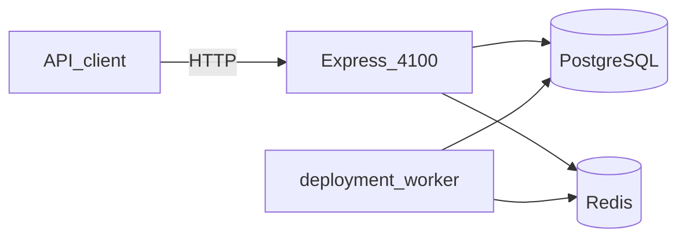
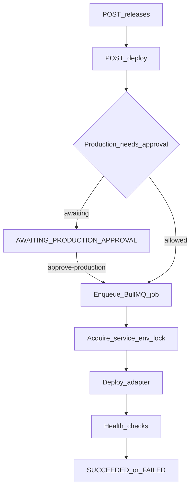
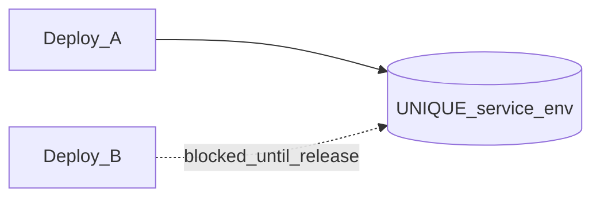

# ReleaseControl

Deploy orchestration for services across environments: Express API, PostgreSQL, Redis/BullMQ worker. Production deploys can require approval; per-service locks prevent collisions.

## System



## Release flow



## Collision lock



Only one active deploy owns `(service_id, environment_id)` at a time.

## API

| Method | Path |
|--------|------|
| GET | `/health` |
| GET, POST | `/api/services` |
| GET, POST | `/api/releases` |
| GET | `/api/releases/:id` |
| POST | `/api/releases/:id/deploy` |
| POST | `/api/releases/:id/approve-production` |
| POST | `/api/releases/:id/rollback` |
| GET | `/api/metrics` |

## Run

```
docker compose up -d db redis
npm install
npm run migrate
npm run seed
npm run dev
```

Worker:

```
npm run worker
```

API: http://localhost:4100

## Stack

- Express
- PostgreSQL (services, releases, locks, events, approvals)
- Redis + BullMQ (`deployment-jobs`)
- Deploy/health adapters are simulated locally so the repo runs without cloud credentials
